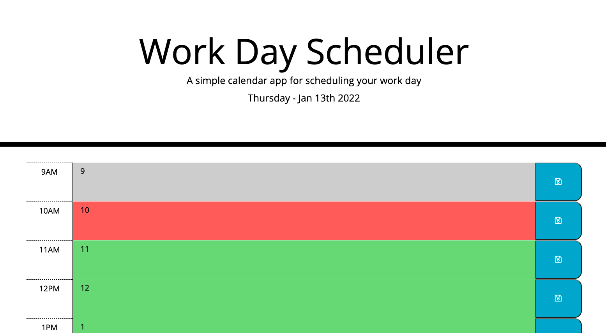

# Homework-05-Work-Day-Scheduler

## Task

This homework task involved using third party APIs (jQuery, Bootstrap and Moment), to create a day schedule that displayed the time, changed the colour of elements based on the time, and saved to local storage.

## User Story

```md
AS AN employee with a busy schedule
I WANT to add important events to a daily planner
SO THAT I can manage my time effectively
```

## Acceptance Criteria

```md
GIVEN I am using a daily planner to create a schedule
WHEN I open the planner
THEN the current day is displayed at the top of the calendar
WHEN I scroll down
THEN I am presented with timeblocks for standard business hours
WHEN I view the timeblocks for that day
THEN each timeblock is color coded to indicate whether it is in the past, present, or future
WHEN I click into a timeblock
THEN I can enter an event
WHEN I click the save button for that timeblock
THEN the text for that event is saved in local storage
WHEN I refresh the page
THEN the saved events persist
```

## Development

The use of the APIs made this homework so much easier than past homeworks as I found a lot of the work already done. I didn't have to think much about layout, tables or time. I did, however have to think about jQuery and understand how it works - how it is similar to vanilla JavaScript, but not exactly the same. Overall, I found this activity enjoyable and it came together rather quickly.

## Screenshot of Deployed Application



### Link:

[Homework 05 - Work Day Scheduler - Clayton McIntosh](https://claytonmcintosh.github.io/Homework-05-Work-Day-Scheduler/)
